# Hand in Hand AI — Design Research & References (v2)

> Closes issue #7. This is the canonical brief for every visual decision on the v2 site.
> Subsequent design issues should reference this doc instead of re-deciding.
>
> **Date captured:** 2026-05-24 · **Author:** design-research subagent · **Status:** locked recommendation, open to refinement during issue #5 (cinematic hero) implementation.
>
> The doc itself is in English (working doc, not customer-facing). The site is bilingual HE+EN, Hebrew-first.

---

## TL;DR — Recommendation

**Confirm Vercel-style as the base.** Light, achromatic, Geist, shadow-as-border, generous whitespace, sidebar + page-head on docs/internal pages.

We'll layer in three things on top:

1. **A single chromatic accent** = the existing HIHA green `rgb(147, 200, 62)` (kept from v1 brand) — used sparingly, the way Resend uses pink or Linear uses purple. The Vercel-pure black/white version reads cold for an Israeli SMB audience; one warm-leaning green accent fixes that without spending the brand.
2. **One cinematic homepage hero only** (issue #5 — scroll-driven WhatsApp chat that types itself). The rest of the site stays Vercel-quiet. This is the "Hybrid" option from the issue, but contained: cinema in the hero, achromatic everywhere else.
3. **Heebo for Hebrew, Geist for Latin**, with Geist Mono for code/timestamps/chat metadata. Heebo is already loaded — it's the one Hebrew geometric sans that doesn't fight Geist on the same page.

Motion library: **Framer Motion** for component-level (chat, cards, hover), **native CSS `scroll-timeline` with a GSAP fallback** for the cinematic hero (issue #5). No Lottie, no WebGL — both fail the maintenance bar.

Why not Linear-style (dark + gradients)? Linear is a power-user tool sold to engineers; we're selling AI agents to fitness studio owners and SMB operators in Israel. Dark cinematic homepages convert worse for that audience, and the maintenance cost of motion-heavy dark UI is real.

Why not pure Vercel (no accent)? Pure achromatic reads as "infra company" — fine for Vercel selling to devs, wrong for an agency selling outcomes. The green keeps the brand warm-blooded.

---

## Section 1 — Reference sites

Twenty-three sites screenshotted at desktop (1440×900) and mobile (390×844 iPhone UA). All screenshots are in `./screenshots/` — `<slug>.png` for desktop, `<slug>-mobile.png` for mobile.

### A. AI agent platforms

#### Lindy
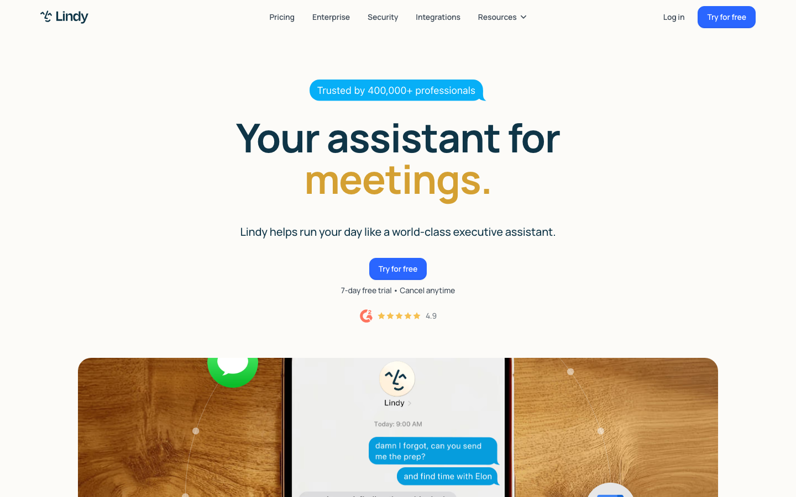
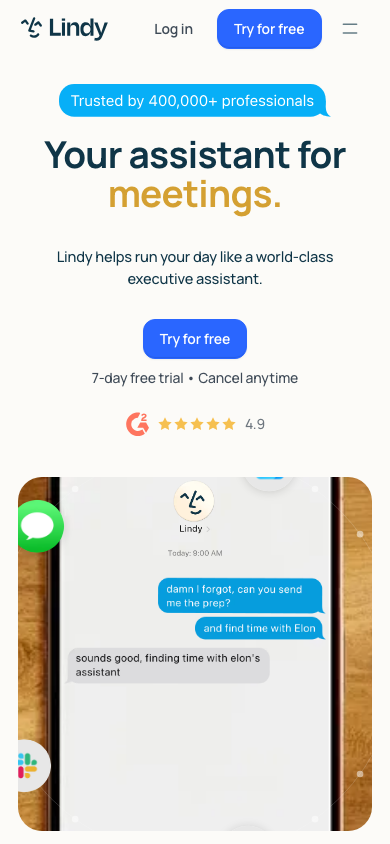

What they do right: **the hero IS the product** — an animated agent-team graph passing tasks across nodes, exactly the "agents that work together" framing we want. Conversion-grade headline ("Build AI agents in minutes") + single CTA + animated proof above the fold.

Steal: the multi-node agent constellation visual; the "Build / Try a template" dual-CTA pattern; the trust strip directly under the hero.

Avoid: the slightly toy-ish purple-pink palette — reads B2C-cute, we want B2B-credible. Their nav is also overloaded.

Mobile: ✅ holds up. Constellation collapses to a vertical scroll list of agent cards. Good.

#### Relevance AI
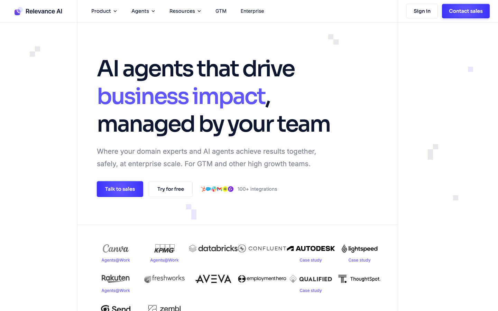
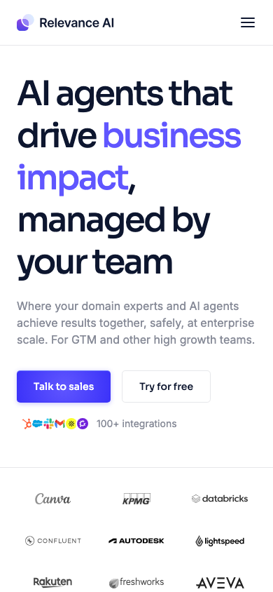

What they do right: "Hire your AI Workforce" framing — agents-as-employees, not agents-as-features. Hero shows a literal org chart of named AI workers (Bosh, Lima, etc.). Pricing tied to "hires" not seats.

Steal: the agent-as-employee mental model — every agent gets a name, role, photo. This is exactly how to sell to a fitness studio owner: "your virtual receptionist Maya works 24/7".

Avoid: the org-chart UI is dense and Latin-only — needs heavy redesign for RTL. Don't lift the layout, lift the framing.

Mobile: ⚠️ partial. Org chart turns into a vertical strip — usable but loses the "team" feeling.

#### Sierra
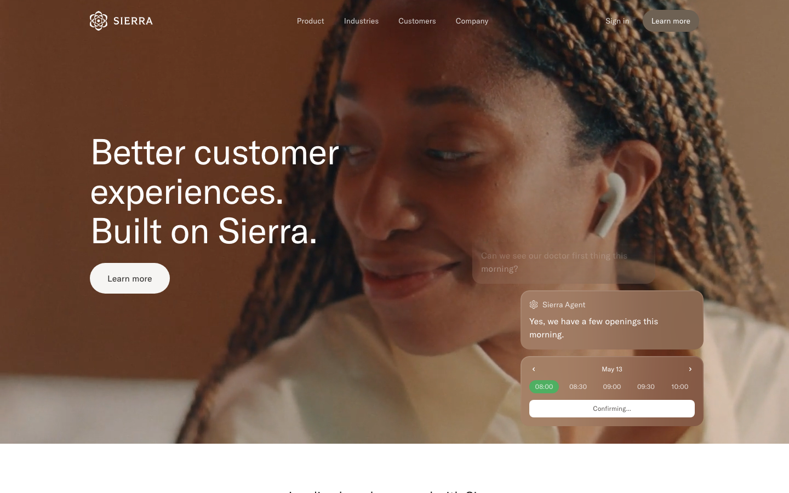
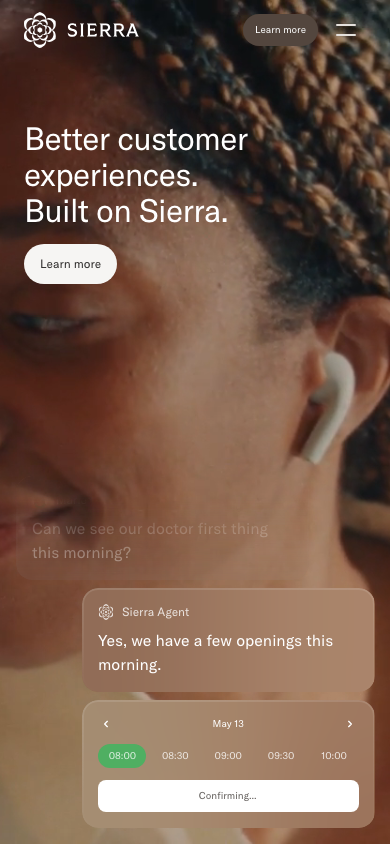

What they do right: enterprise-credible without being boring. Big serif-ish display type, real customer logos above the fold (ADT, SiriusXM, Sonos), case-study-first scroll. Treats agents as a deployed product, not a demo.

Steal: the logo strip + case-study card layout for our "Worked with" section. The quiet confidence of the typography (no exclamation marks anywhere).

Avoid: the all-text hero — works for them because they have Bret Taylor's halo. We need a visual.

Mobile: ✅ excellent. Type scale collapses cleanly, no weird overflow.

#### Inflection
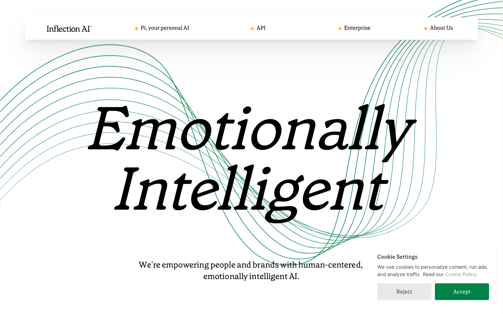
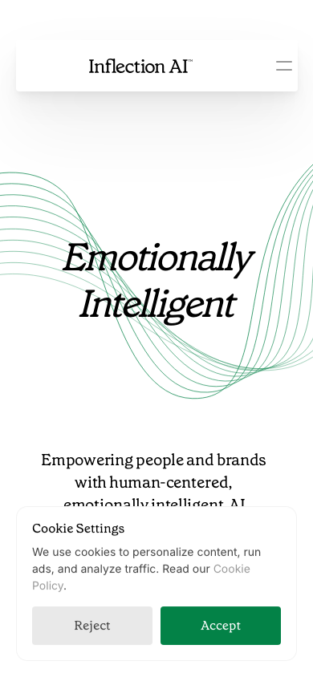

What they do right: B2B-focused after the Pi pivot — "Enterprise AI" with a clean grid of solution cards. Restrained palette, lots of white.

Steal: the solution-card grid layout for our services section (one card per vertical: fitness, dental, real estate).

Avoid: post-pivot the site feels generic — they lost the personality Pi had. Lesson: don't over-correct toward "enterprise" and lose warmth.

Mobile: ✅ fine, standard responsive cards.

#### Cognition (Devin)
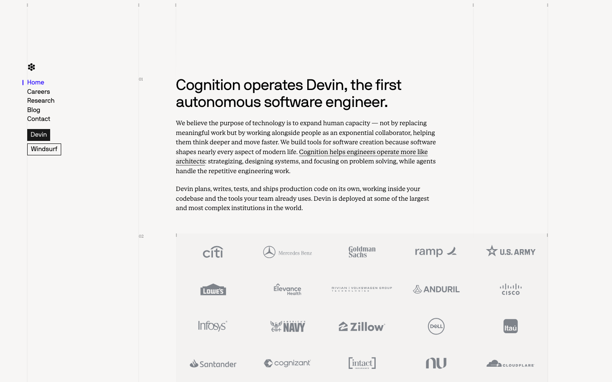
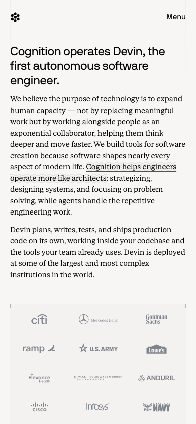

What they do right: cinematic dark hero with a real terminal/IDE recording of Devin working autonomously. The "watch it actually do the job" demo is the whole pitch.

Steal: the **embedded autoplaying terminal/chat as social proof** pattern — for us, an autoplaying WhatsApp conversation showing the agent booking a class.

Avoid: pure dark theme — wrong for our market segment. Also, their motion is heavy (large video file); we'd use lighter CSS-driven motion instead.

Mobile: ✅ video shrinks and stays watchable.

#### Adept
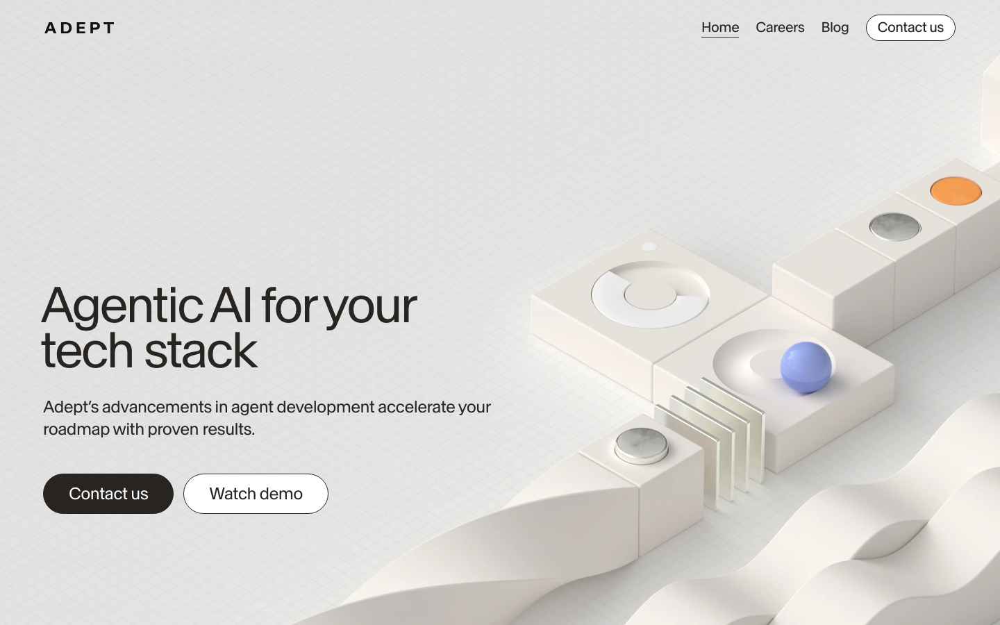
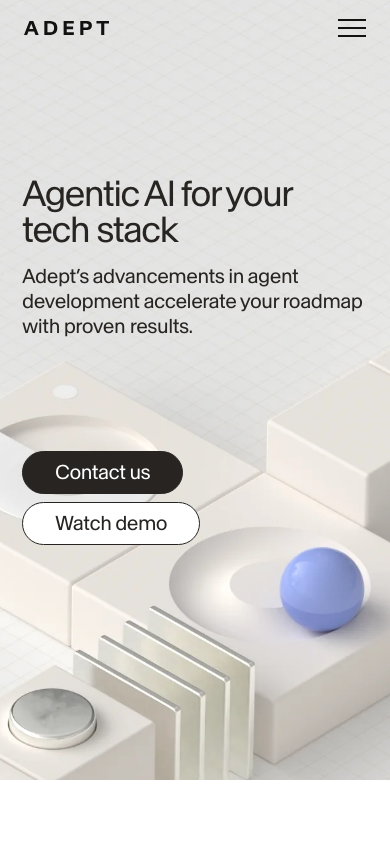

What they do right: research-lab aesthetic — minimal, type-driven, academic. Communicates "serious AI people" without trying.

Steal: the editorial typography on the research/blog index page (useful when we have a "Field notes" section later).

Avoid: this is a research lab style — too austere for selling. Reference, don't copy.

Mobile: ✅ text-heavy sites always mobile well.

### B. AI labs / agency-adjacent

#### Anthropic
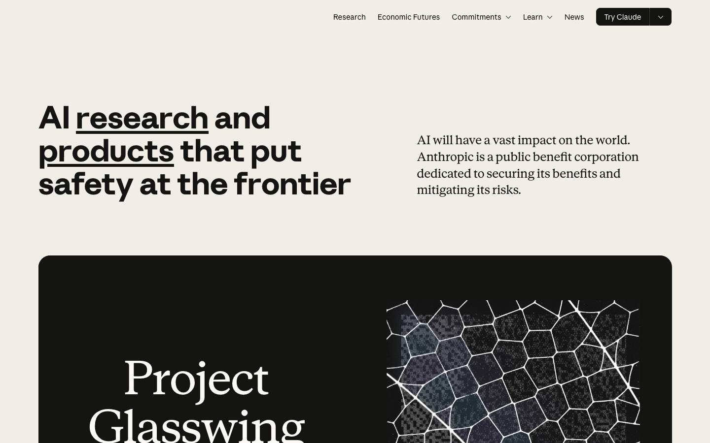
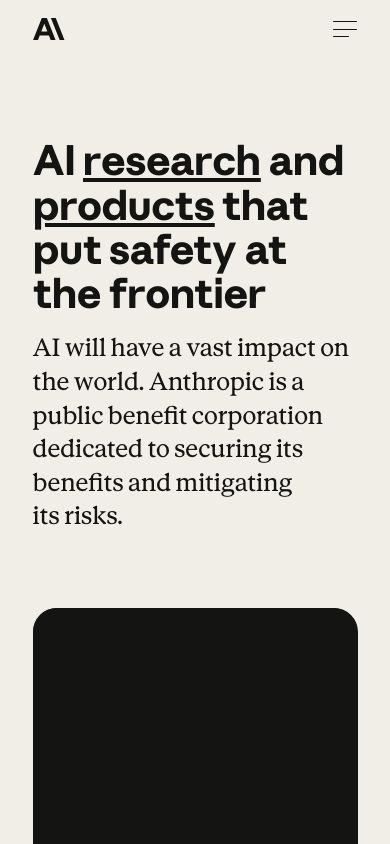

What they do right: warm terracotta accent + cream background = unmistakable identity in a sea of black AI sites. Editorial layout, large serif-ish headings, generous line-height. The cream background is the brand.

Steal: **the courage to use a non-white background and a warm accent.** This validates our green-accent decision. Also their footer is gorgeous — link-dense without feeling cluttered.

Avoid: their nav uses a custom mega-menu that's expensive to build correctly in RTL.

Mobile: ✅ exemplary. The hero composition (text left, illustration right) reflows to stacked perfectly.

#### OpenAI
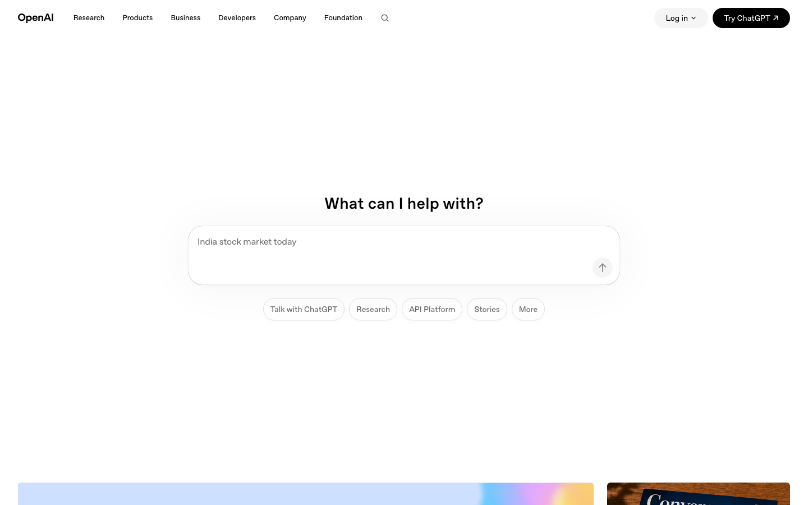
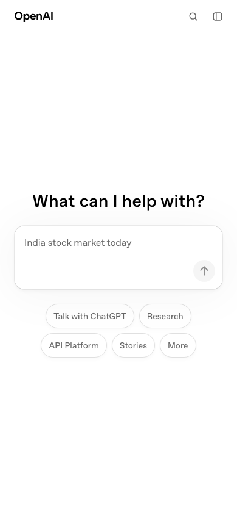

What they do right: black/white minimalism, huge type, single product card per scroll-screen. Almost no decoration. Confidence-as-design.

Steal: the **one-product-card-per-fold** scroll pattern (currently used for ChatGPT / Sora / API on their home). Maps to our service pages: one card per vertical, full-bleed.

Avoid: the recent redesign trades warmth for sterility. For an agency we need more handcraft.

Mobile: ✅ near-perfect. Built mobile-first.

#### Imbue
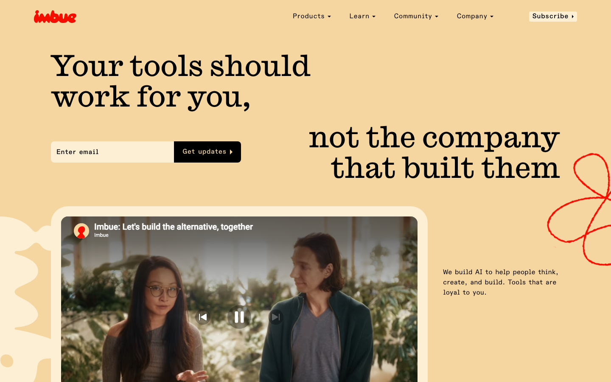
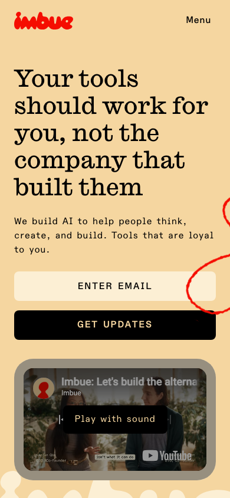

What they do right: warm cream + chunky typography + hand-drawn-feeling illustration. Anti-AI-slop aesthetic — looks like a human made it.

Steal: **the cream/off-white background tone** (`#f7f3ec`-ish) as an alternative to pure white for "trust" sections. Hand-feel illustration style is great inspiration for our future custom imagery.

Avoid: the homepage is essentially a manifesto — too text-heavy for a service-selling page.

Mobile: ✅ stacks cleanly, type stays legible.

#### Reka
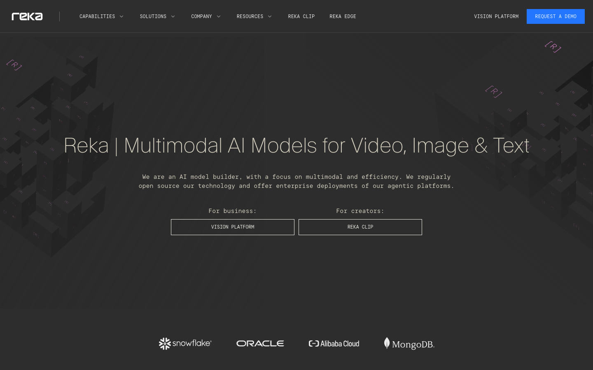
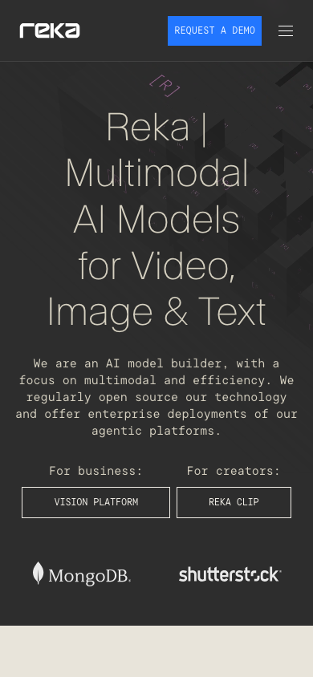

What they do right: dark gradient hero + tasteful motion. Clear product hierarchy (models, products, research).

Steal: their model-card grid is a strong pattern for showing capabilities side-by-side. We can adapt for "agent skills".

Avoid: heavy gradient backgrounds — pretty but generic-2025-AI-startup. Already overused.

Mobile: ✅ adequate.

### C. Premium product marketing

#### Linear
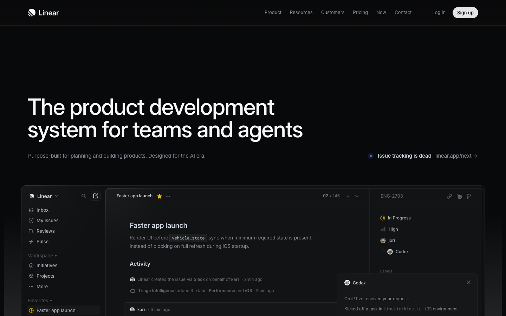
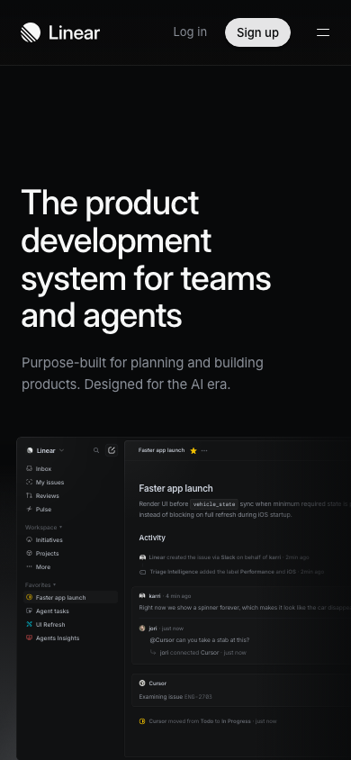

What they do right: the gold standard of dark-mode marketing. Precise typography, gradient that *means something* (purple = priority), motion-as-affordance not motion-as-decoration. Every transition has intent.

Steal: the **shadow-as-border card style** (subtle inner gradient stroke + soft outer shadow). Their footer organization is also industry-best.

Avoid: full dark mode — wrong for our audience. The Linear aesthetic is dev-tool catnip; SMB owners read it as "I won't understand this".

Mobile: ✅ flawless, but heavy — first paint is slow on mid-tier phones.

#### Vercel — **base direction**
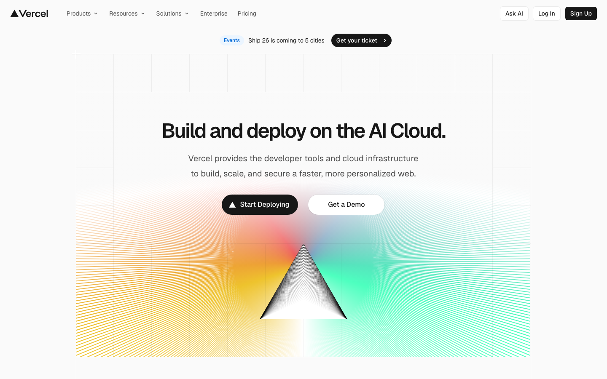
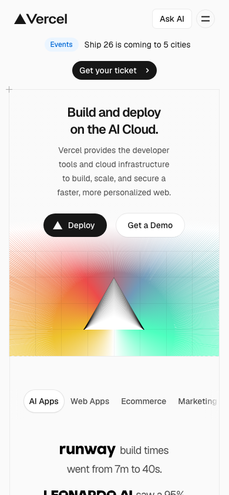

What they do right: black/white precision, Geist everywhere, shadow-as-border on every card, sidebar+page-head dashboard pattern. The "Ship faster" hero with the live deploy log is one of the best hero implementations on the web. Every component is a primitive: button, card, badge, code-block — and they compose.

Steal: **everything structural.** Geist font system, achromatic palette, `1px hairline border + tiny shadow` card style, 8pt spacing grid, ultra-tight letter-spacing on display type. This is our base.

Avoid: it can read cold if not warmed. We solve that with the green accent + Heebo for Hebrew + one cinematic hero on home.

Mobile: ✅ best-in-class. Geist holds at 14px on mobile.

#### Stripe
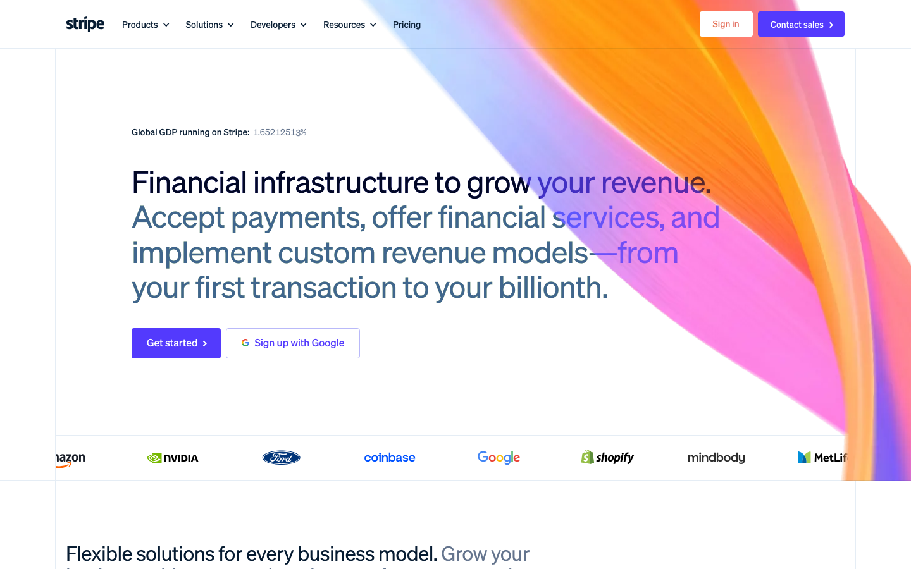
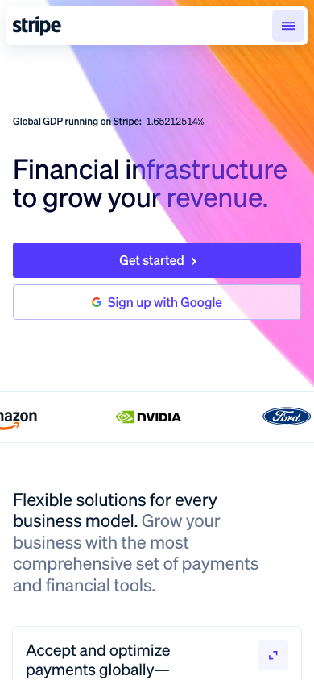

What they do right: signature animated gradient + weight-300 sohne-var elegance. Long, narrative-driven scroll pages with synchronized illustrations. Industry-defining marketing site for ~10 years.

Steal: the **scroll-synced narrative pattern** for a future case-study page (one customer story, scrolled cinematically). Color-card pattern for product categories.

Avoid: the gradient hero is so iconic it's a tell. Anyone copying it reads as derivative. Inspire-only.

Mobile: ✅ excellent. Gradient still ships on mobile but doesn't kill perf.

#### Resend
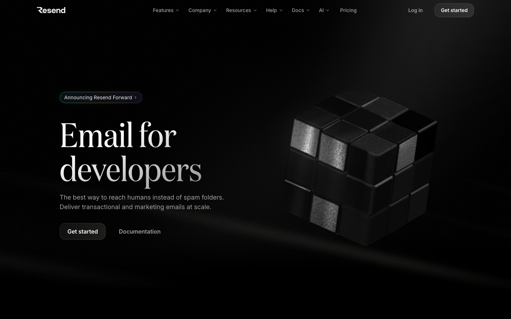
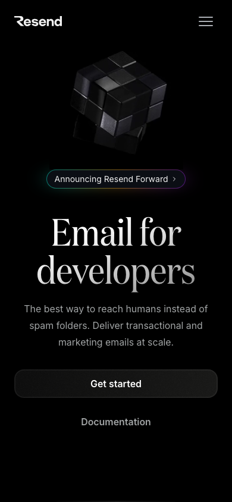

What they do right: **dev-tool aesthetic but warm** — dark theme with a single pink accent. Code-first marketing (the hero is a code block). Tiny details: the pink dot on the logo, the way they use Inter+Mono.

Steal: the **single-accent-color discipline** — they use exactly one warm color and it does all the work. This is our model for the green accent.

Avoid: dark theme.

Mobile: ✅ great. Code block becomes horizontally scrollable, which is the right answer.

#### Cursor
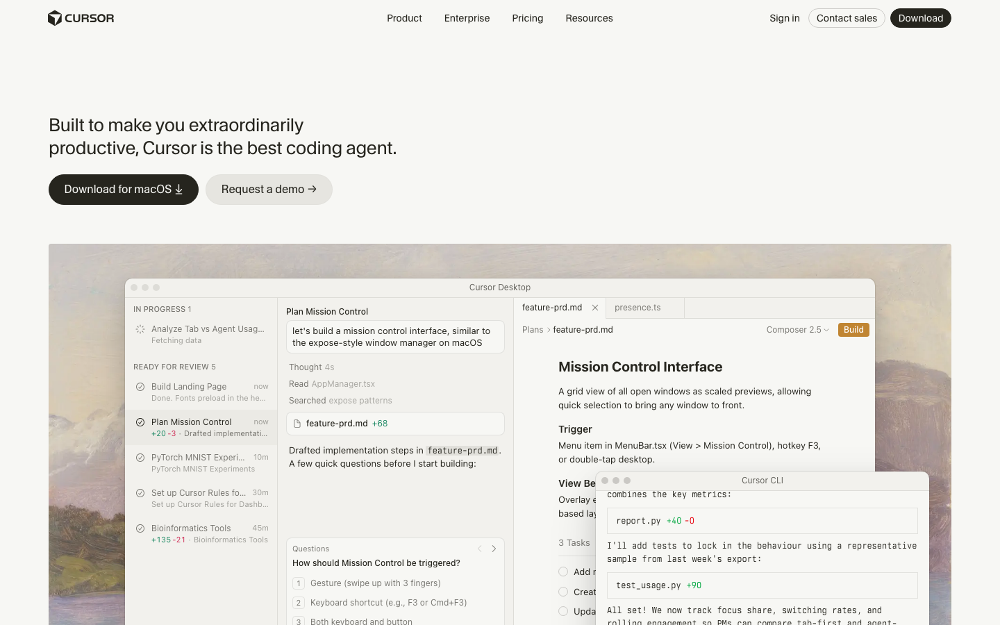
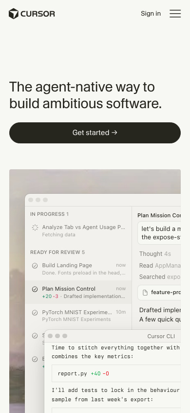

What they do right: very fast first paint, video-in-hero showing the IDE doing magic. Clean nav, single CTA ("Download").

Steal: the **autoplay-product-demo-as-hero** pattern. For us, that's the WhatsApp scroll-typing scene (issue #5).

Avoid: the gradient mesh background is starting to age — feels late-2024.

Mobile: ✅ video swaps to a poster on mobile (good perf decision).

#### Arc (The Browser Company)
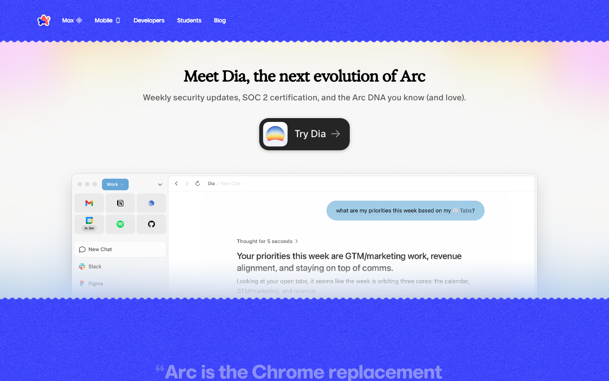
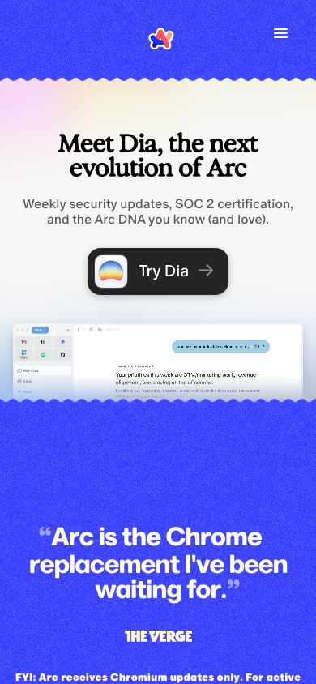

What they do right: editorial-y, illustration-heavy, opinionated. Treats the marketing site like a magazine. Distinct.

Steal: the **opinionated voice** — they write like a person, not a company. Our HE copy can do this.

Avoid: heavy custom illustration is expensive and goes stale. Don't build the visual identity around it.

Mobile: ✅ designed for it.

#### Notion AI
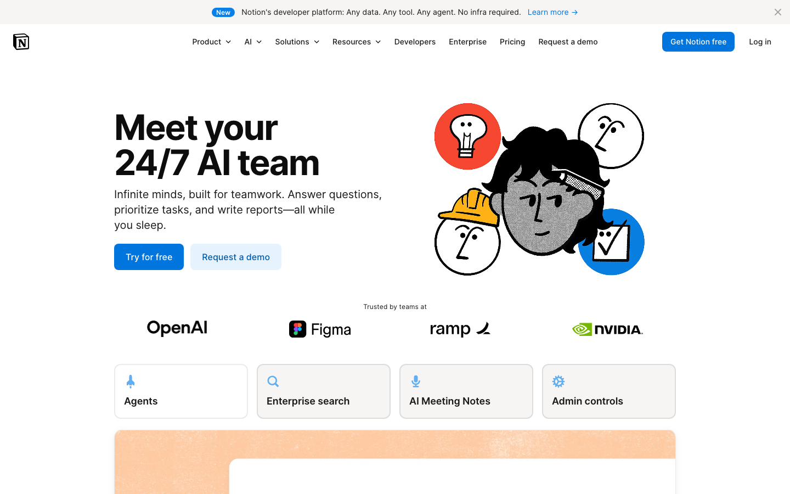
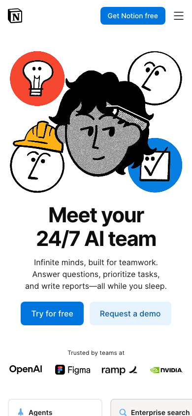

What they do right: integrates AI as a feature, not as the entire identity. Warm minimalism, subtle, the AI feels assistive not invasive. Soft serif headings.

Steal: the **subtle "AI is here to help" tone** — never "AI is taking over". Useful framing for the Israeli SMB audience who's anxious about AI replacing staff.

Avoid: their AI page is currently underbuilt for the size of the bet; not aspirational.

Mobile: ✅ exemplary as always.

### D. Hebrew-first / Israeli comparables

#### AI21 Labs (Israeli)
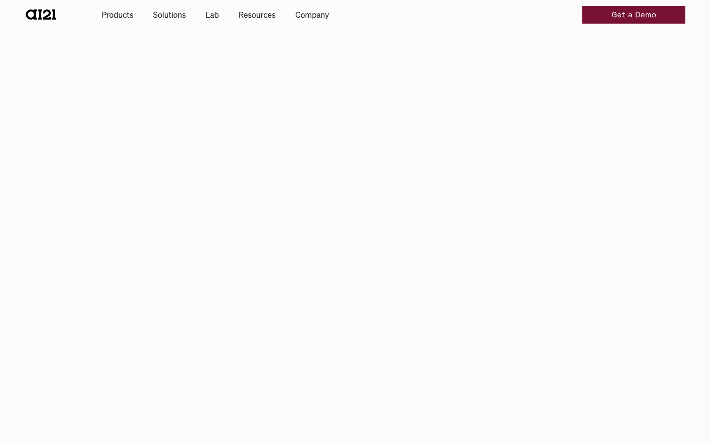
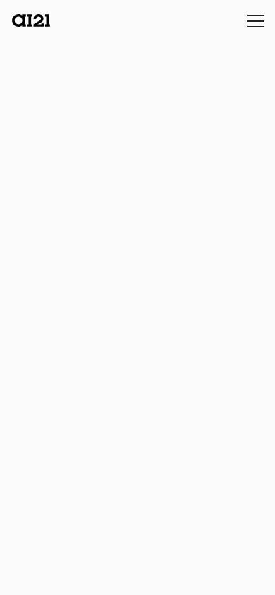

What they do right: serious, model-grade messaging ("Jamba", "Maestro"). Clean enterprise palette, hero clearly states what they sell ("AI Foundation Models for the Enterprise"). Site is **English-only** — interesting choice for an Israeli company.

Steal: the **enterprise-credible-but-not-cold** tone. The way they put real benchmark numbers in the hero builds trust.

Avoid: English-only is a deliberate signal that they sell internationally. We're explicitly bilingual — they're not a layout reference for HE, only a tone reference.

Mobile: ✅ standard responsive.

#### Lemonade (Israeli)
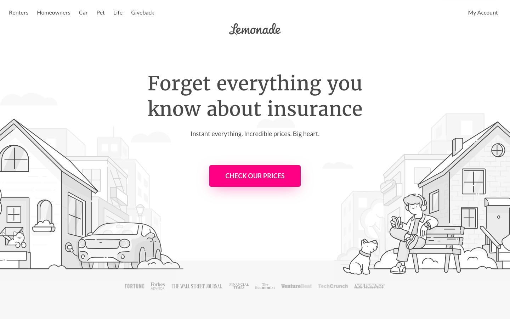
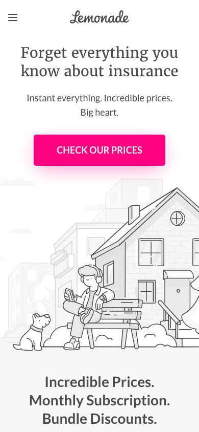

What they do right: pink-on-white, friendly, conversational. Designed for consumers but executed like a tech company. Strong illustrations.

Steal: nothing structural (different audience) but the **fearless single-accent-color** approach validates the green-accent strategy.

Avoid: B2C tone. For agency work we need quieter.

Mobile: ✅ great, mobile-first product.

#### Wix
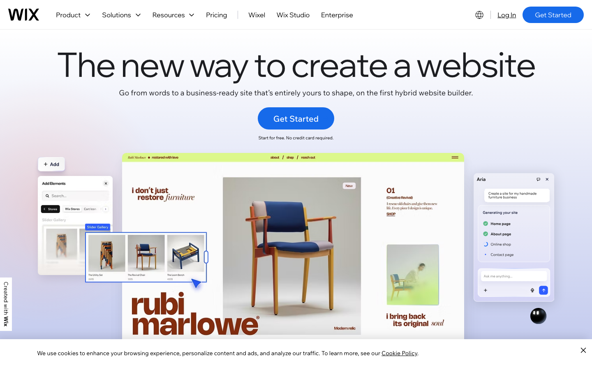
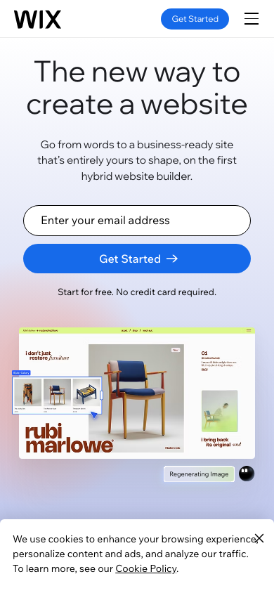

What they do right: massive, dense, multi-product nav that somehow still works. Hebrew version (`he.wix.com`) is excellent RTL implementation — type, alignment, nav direction all correct.

Steal: **RTL implementation reference.** When in doubt about how a pattern should mirror, check Wix-HE first. They've solved every edge case.

Avoid: the visual identity itself — too dense for a single-service agency.

Mobile: ✅ obsessively mobile-first.

#### Monday.com (Israeli)
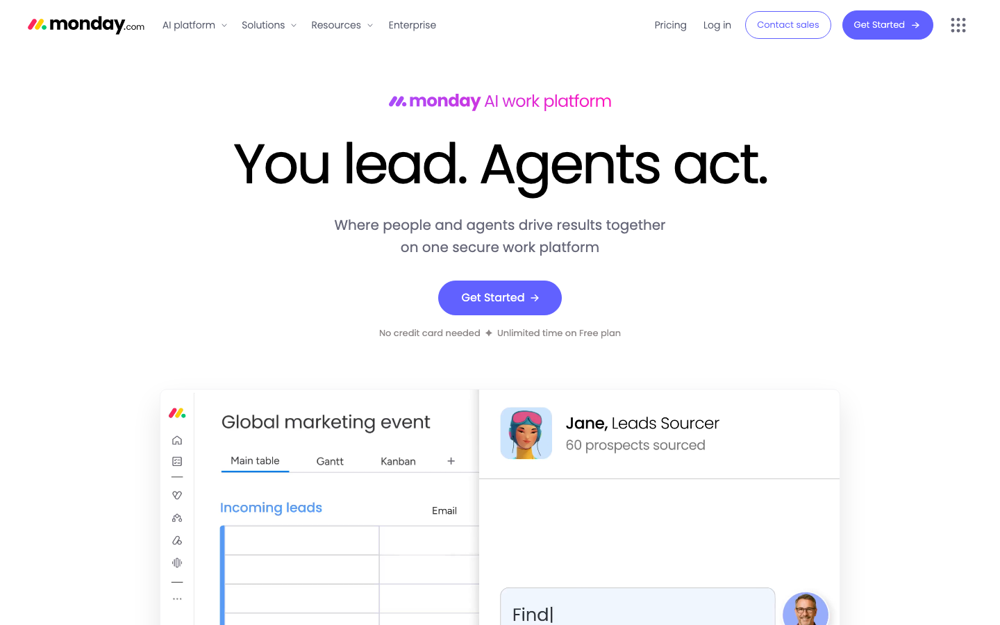
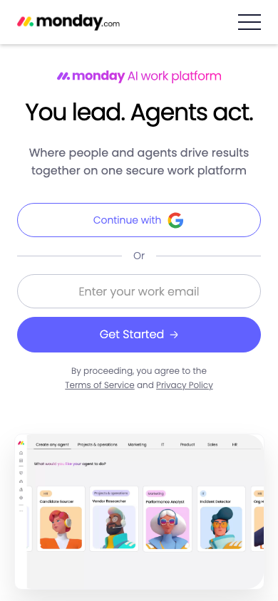

What they do right: bold color blocks, big illustrations, clear "for X teams" segmentation. The "use case selector" pattern (pick your team type) is conversion-optimized.

Steal: the **vertical-selector pattern** ("I run a [fitness studio | dental clinic | real estate office]"). This is gold for an agency.

Avoid: color overload — every section is a different color. Too loud for our brand.

Mobile: ✅ designed mobile-first.

### E. Multi-agent framing

#### CrewAI
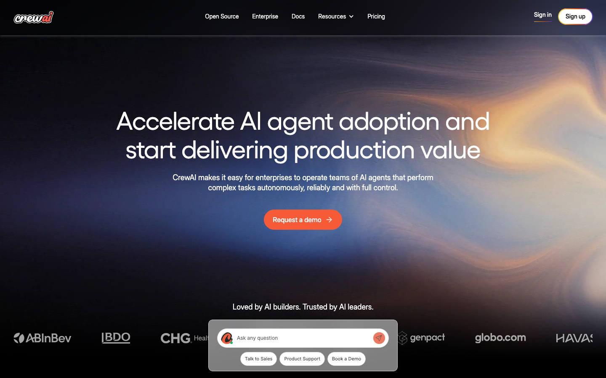
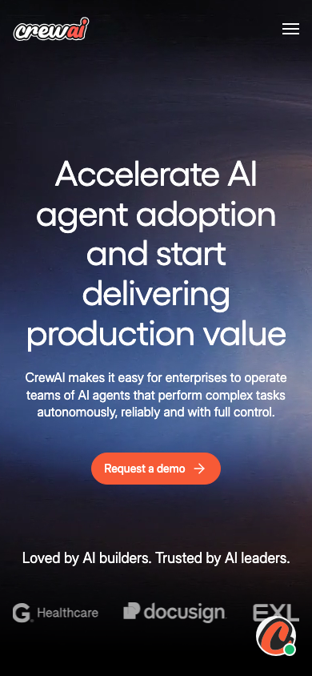

What they do right: visual metaphor of a "crew" — agents grouped together with a clear leader/worker hierarchy. Dark theme works because the audience is technical.

Steal: the **explicit role/hierarchy visualization** — useful when explaining a multi-agent workflow to a non-technical customer ("the receptionist agent talks to the scheduling agent who talks to the reminder agent").

Avoid: developer-aimed framing. We're customer-aimed.

Mobile: ✅ adequate.

#### AutoGen (Microsoft)
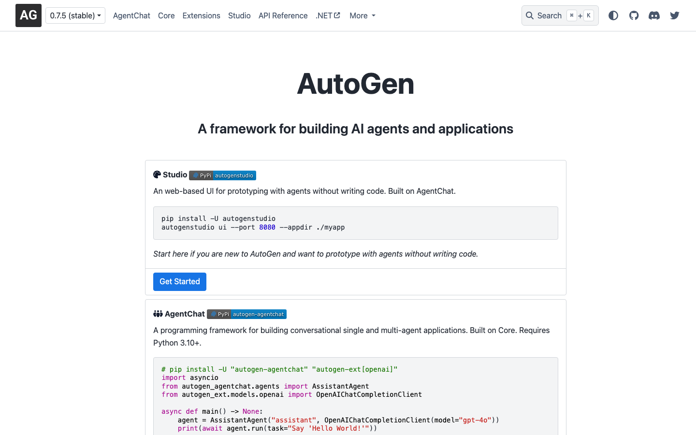
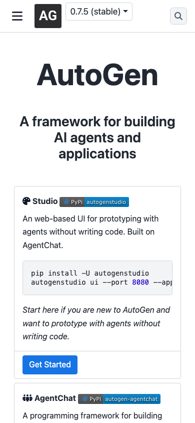

What they do right: documentation-as-marketing — the site is a docs site that happens to sell. Honest, low-key, credible because it doesn't try to be marketing.

Steal: the **docs-quality information density** for our future "how it works" deep-dive pages.

Avoid: this is a docs site, not a marketing site. Don't make our homepage this.

Mobile: ✅ Sphinx/MkDocs themes are mobile-native.

---

## Section 2 — Design tokens

Drop into `src/styles/hiha-tokens.css`. **This is a spec — don't write the CSS yet.** The current `hiha-tokens.css` (v1) is preserved; v2 tokens get a `--hiha2-*` prefix during transition and the v1 tokens are deprecated section-by-section.

### 2.1 Color (achromatic + single accent)

```
/* — Surfaces (light, achromatic) — */
--hiha2-bg              #ffffff
--hiha2-bg-subtle       #fafafa     /* page sections, alt rows */
--hiha2-bg-muted        #f5f5f5     /* cards on white, code blocks */
--hiha2-bg-warm         #f7f3ec     /* OPTIONAL trust sections (Anthropic/Imbue feel) */
--hiha2-bg-inverse      #0a0a0a     /* cinematic hero, footer */

/* — Text (achromatic, generous contrast) — */
--hiha2-fg              #0a0a0a     /* body */
--hiha2-fg-strong       #000000     /* display headings only */
--hiha2-fg-muted        #525252     /* secondary */
--hiha2-fg-subtle       #737373     /* tertiary, meta */
--hiha2-fg-faint        #a3a3a3     /* placeholder, disabled */
--hiha2-fg-inverse      #fafafa     /* text on dark */

/* — Borders (hairline, the Vercel pattern) — */
--hiha2-border          #e5e5e5     /* default */
--hiha2-border-strong   #d4d4d4     /* hover, focus surrounds */
--hiha2-border-inverse  #262626     /* on dark */

/* — Accent (single chromatic, used sparingly) — */
--hiha2-accent          #93C83E     /* HIHA green, preserved from v1 */
--hiha2-accent-hover    #84B536
--hiha2-accent-soft     #EEF7DC     /* tinted backgrounds, pills */
--hiha2-accent-fg       #2F4A12     /* text-on-soft-accent */
--hiha2-accent-ring     rgba(147,200,62,0.32)  /* focus ring */

/* — Functional — */
--hiha2-success         #16a34a
--hiha2-warning         #d97706
--hiha2-danger          #dc2626
--hiha2-info            #2563eb
```

**Rule:** if a section uses more than 1 chromatic color, redesign it. Accent appears on: primary CTA, links, focus rings, the green dot/badge on the logo, and as the single tint in illustrations. Everywhere else is achromatic.

### 2.2 Typography

Families (load via `@fontsource` or Google Fonts):
```
--hiha2-font-sans-he    "Heebo", "Geist", system-ui, -apple-system, sans-serif
--hiha2-font-sans-en    "Geist", "Heebo", system-ui, -apple-system, sans-serif
--hiha2-font-mono       "Geist Mono", "JetBrains Mono", ui-monospace, monospace
```

(`html[lang="he"]` switches the body font-family to `--hiha2-font-sans-he`; `html[lang="en"]` switches to `--hiha2-font-sans-en`. Both still fall back to the other so mixed-script labels don't break.)

Type scale (modular, 1.250 minor-third, base 16):
```
--hiha2-text-xs         12px / 16px / 0
--hiha2-text-sm         14px / 20px / 0
--hiha2-text-base       16px / 24px / 0
--hiha2-text-lg         18px / 28px / 0
--hiha2-text-xl         20px / 30px / -0.005em
--hiha2-text-2xl        24px / 32px / -0.01em
--hiha2-text-3xl        30px / 38px / -0.015em
--hiha2-text-4xl        36px / 44px / -0.02em
--hiha2-text-5xl        48px / 56px / -0.025em
--hiha2-text-6xl        60px / 68px / -0.03em
--hiha2-text-display    72px / 76px / -0.035em   /* hero only */

/* Weights (Geist + Heebo both ship VF) */
--hiha2-fw-regular      400
--hiha2-fw-medium       500
--hiha2-fw-semibold     600
--hiha2-fw-bold         700
```

Display headings use `-0.02em` to `-0.035em` tracking (Vercel-tight). Body stays at `0`. Hebrew never gets negative tracking — Heebo's spacing is already optimized.

### 2.3 Spacing (4pt grid, scales out to 8pt past 16)

```
--hiha2-space-0    0
--hiha2-space-1    4px
--hiha2-space-2    8px
--hiha2-space-3    12px
--hiha2-space-4    16px
--hiha2-space-5    24px
--hiha2-space-6    32px
--hiha2-space-7    48px
--hiha2-space-8    64px
--hiha2-space-9    96px
--hiha2-space-10   128px
--hiha2-space-11   160px
```

### 2.4 Radii

```
--hiha2-radius-none  0
--hiha2-radius-sm    6px       /* inputs, small buttons */
--hiha2-radius-md    8px       /* default cards */
--hiha2-radius-lg    12px      /* large cards */
--hiha2-radius-xl    16px      /* feature panels */
--hiha2-radius-2xl   24px      /* hero panels */
--hiha2-radius-full  9999px    /* pills, avatars */
```

(The v1 `--hiha-radius-pill: 32px` was over-rounded for the new aesthetic — pills become true pills via `radius-full`.)

### 2.5 Shadows (shadow-as-border, the Vercel pattern)

Each shadow is paired with a 1px hairline border for the "stamped onto the page" effect.

```
--hiha2-shadow-xs    0 1px 2px 0 rgb(0 0 0 / 0.04)
--hiha2-shadow-sm    0 1px 2px 0 rgb(0 0 0 / 0.04), 0 2px 4px 0 rgb(0 0 0 / 0.04)
--hiha2-shadow-md    0 4px 6px -1px rgb(0 0 0 / 0.06), 0 2px 4px -2px rgb(0 0 0 / 0.04)
--hiha2-shadow-lg    0 10px 15px -3px rgb(0 0 0 / 0.08), 0 4px 6px -4px rgb(0 0 0 / 0.04)
--hiha2-shadow-xl    0 20px 25px -5px rgb(0 0 0 / 0.10), 0 8px 10px -6px rgb(0 0 0 / 0.04)
--hiha2-shadow-ring  0 0 0 4px var(--hiha2-accent-ring)   /* focus */
--hiha2-shadow-inner inset 0 1px 0 0 rgb(255 255 255 / 0.06)  /* for dark CTAs */
```

Default card recipe: `border: 1px solid var(--hiha2-border); box-shadow: var(--hiha2-shadow-sm);`.

### 2.6 Motion tokens

```
--hiha2-ease-out      cubic-bezier(0.22, 1, 0.36, 1)
--hiha2-ease-in-out   cubic-bezier(0.65, 0, 0.35, 1)
--hiha2-ease-spring   cubic-bezier(0.34, 1.56, 0.64, 1)

--hiha2-dur-instant   80ms
--hiha2-dur-fast      160ms
--hiha2-dur-base      240ms
--hiha2-dur-slow      400ms
--hiha2-dur-slower    640ms
```

### 2.7 Layout

```
--hiha2-container-sm   640px
--hiha2-container-md   768px
--hiha2-container-lg   1024px
--hiha2-container-xl   1200px      /* default page max */
--hiha2-container-2xl  1440px      /* hero only */

--hiha2-page-pad-x     clamp(16px, 4vw, 48px)
```

Breakpoints align to Tailwind 4 defaults: `sm 640 / md 768 / lg 1024 / xl 1280 / 2xl 1536`.

---

## Section 3 — Motion patterns

Five patterns, ordered by priority. Each one: live reference, library, mobile feasibility, perf budget.

### 3.1 Scroll-driven cinematic hero — WhatsApp chat that types itself
**Already issue #5.** This doc does not redesign it, only confirms tech choices.

- **Live reference:** [apple.com/airpods-pro](https://www.apple.com/airpods-pro/) (scroll-pinned scenes), [stripe.com/sessions](https://stripe.com/sessions) (scroll-linked panel reveals), [cognition.ai](https://www.cognition.ai/) (autoplay terminal in hero).
- **Library:** CSS `scroll-timeline` + `view-timeline` where supported, **GSAP ScrollTrigger** as the fallback. Avoid Framer Motion's `useScroll` for the pinned timeline — it doesn't pin reliably across iOS Safari.
- **Mobile:** scroll-timeline works on iOS Safari 17+. For older browsers, the chat plays on an `IntersectionObserver` trigger instead of scroll-tied — degrades gracefully to "autoplay once when in view".
- **Perf:** budget 80KB JS + 0 video files. The chat is real DOM (text nodes), no canvas. CLS = 0 because the phone frame reserves space.
- **Compatibility with issue #5:** this doc adopts the choice; #5 is the implementation issue.

### 3.2 Agent-team constellation (multi-agent visualization)
- **Live reference:** [lindy.ai hero](https://www.lindy.ai/) — animated node graph; [crewai.com](https://www.crewai.com/) — crew visualization.
- **Library:** **Framer Motion** + plain SVG. Each agent node = SVG `<circle>` with a Framer Motion layout animation; tasks flowing between agents = animated `<path>` strokes (`pathLength` 0→1, looped).
- **Mobile:** the desktop layout is a wide DAG. On mobile, collapse to a vertical sequence list with the same connector lines but stacked. Don't try to shrink the DAG.
- **Perf:** SVG with 6–8 nodes + 8–12 connectors stays well under 16ms/frame. No issue.
- **Use:** the "How it works" section, not the hero.

### 3.3 Card hover — lift + accent border
- **Live reference:** [linear.app](https://linear.app) feature cards; [vercel.com](https://vercel.com) product cards.
- **Library:** **CSS only** (`transform: translateY(-2px); border-color: var(--hiha2-accent); transition: 160ms var(--hiha2-ease-out)`). No JS.
- **Mobile:** `@media (hover: hover)` gate — no hover effects on touch.
- **Perf:** free.

### 3.4 Heading reveal on scroll-into-view
- **Live reference:** [resend.com](https://resend.com), [stripe.com](https://stripe.com).
- **Library:** **Framer Motion** `whileInView` with `viewport={{ once: true, margin: "-80px" }}`. 240ms fade + 8px translateY. Subtle — not a parallax.
- **Mobile:** ✅ same animation, same duration.
- **Perf:** under 5KB extra per page once Framer is loaded.
- **Accessibility:** wrap in `@media (prefers-reduced-motion: reduce)` — skip the translate, keep the fade.

### 3.5 Typewriter for the hero subhead (single use, hero only)
- **Live reference:** [openai.com](https://openai.com) early ChatGPT hero, [vercel.com/ai](https://vercel.com/ai).
- **Library:** **CSS `@keyframes` + `steps()`** + a JS handoff to rotate between 2–3 phrases (e.g. "books a class", "answers questions", "follows up with leads"). No library.
- **Mobile:** ✅ identical behavior, but pause one phrase per loop to avoid distraction during scroll.
- **Perf:** trivial.
- **Restriction:** **one typewriter per page max.** Multiple typewriters scream "AI demo site, circa 2023".

### Rejected
- **Mesh gradient that responds to cursor** (Stripe-style): pretty but compute-heavy on mid-tier Android and reads as "generic AI startup 2024". Skip.
- **WebGL/Three.js hero**: maintenance burden too high for an agency site. Skip.
- **Lottie animations**: another runtime + designers need After Effects to update them. Skip.

---

## Section 4 — Content / copy structure patterns

Templates only — no actual HIHA copy yet (that's a separate copywriting pass).

### 4.1 Hero patterns

**Pattern A — Outcome + product (Lindy/Vercel):**
```
[H1]  <Outcome verb> + <noun phrase> in <timeframe>
[Sub] <One sentence on the "how" + audience qualifier>
[CTA] Primary: "<Verb> a <thing>" · Secondary: "<See | Watch | Read>"
```

**Pattern B — Identity + proof (Sierra/Anthropic):**
```
[H1]  <Two words that are the brand promise>
[Sub] <Sentence on what you do + who you serve>
[Logo strip] <6 customer logos, single row, grayscale>
[CTA] Single, low-pressure ("Talk to us")
```

**Pattern C — Show-don't-tell (Cognition/Cursor):**
```
[H1]  <Bold claim>
[Demo] <Autoplaying product evidence above the fold>
[CTA] Below the demo, not above
```

For HIHA we use **C for the homepage** (the WhatsApp scene IS the proof) and **A for service-vertical pages** (`/fitness-studio`, `/fitness-chain`, etc.).

### 4.2 Section header patterns

**The "step-numbered" sub-section (How it works):**
```
[Eyebrow] <2–3 word section label> · uppercase, accent color, tracking +0.08em
[H2]      <Promise-statement, one line>
[Sub]     <Optional 1-sentence elaboration>
[Step cards] 01 / 02 / 03 — each with icon + 1-line title + 2-line body
```

**The "split feature" (Linear/Vercel):**
```
[Eyebrow]
[H2]  <Outcome statement>
[Body 2 cols]  Left: 2-paragraph explainer + bullet list. Right: visual / mock / code.
```

**The "Cases" section (Sierra/Stripe):**
```
[H2]  "How teams use <product>"
[Card grid] 3 cards. Each: customer logo + 1-line outcome + "Read" link.
```

### 4.3 CTA copy patterns

- Primary CTA = verb + object: "Book a discovery call", "See it work", "Build your agent".
- Secondary CTA = read/watch: "Read a case study", "Watch a 60-sec demo".
- **No** "Get started" alone — too vague, no information.
- **No** "Learn more" alone — same reason.
- For HE: imperative verbs work; avoid the polite "אנא" register. Match Wix/Monday HE tone.

### 4.4 Footer structure

Anthropic + Vercel are the references. Four columns: Product · Solutions · Resources · Company. Plus an utility row (lang switcher, status, sitemap, privacy). Subtle, no decoration.

---

## Section 5 — Mobile-first checks (summary)

Every reference was captured at 390×844 (iPhone UA). Summary of patterns that **survive** mobile vs patterns that **don't**, with our adoption decision:

| Pattern | Mobile | Adopt? |
|---|---|---|
| Vercel shadow-as-border cards | ✅ scales | Yes — primary card pattern |
| Lindy multi-agent constellation | ✅ stacks to list | Yes for "How it works" |
| Relevance AI org-chart hero | ⚠️ loses meaning | No — borrow framing only |
| Cognition autoplay terminal | ✅ shrinks cleanly | Yes — our WhatsApp scene equivalent |
| Anthropic warm bg + serif | ✅ exemplary | Yes for trust/about sections |
| Linear dark + gradients | ✅ works but heavy | No — wrong audience |
| Stripe gradient mesh | ✅ but expensive | No — generic-feeling |
| Notion AI subtle assistive tone | ✅ | Yes — copy tone reference |
| Wix HE RTL implementation | ✅ best-in-class | Yes — RTL reference, not visual |
| Monday vertical selector | ✅ excellent | Yes — service-picker pattern |
| Mesh gradients responding to cursor | ❌ touch has no cursor | No |
| Hover-only interactions | ❌ no hover on touch | Gate with `@media (hover: hover)` |
| Large WebGL heroes | ⚠️ battery + perf | No |
| Typewriter heroes | ✅ work but distract | One per page max, hero only |
| Custom heavy illustrations | ✅ but go stale | Limit to 1–2 per page |

**Mobile-first rules we lock in:**
1. Every component is designed at 390px width *first*, then enhanced for desktop.
2. No interaction is hover-only. Touch fallback for every hover-revealed element.
3. Hero must be functional and visually complete with **zero JS executed** (the scroll-driven enhancement is layered on top).
4. Total above-the-fold weight on mobile: ≤ 250KB transferred (HTML + critical CSS + fonts + 1 hero image). No video in the mobile hero.
5. Tap targets ≥ 44×44px (also matches WCAG 2.5.5 AAA).
6. RTL is tested on real iOS Safari, not just Chrome devtools. Wix-HE is the gold-standard reference.

---

## Appendix — Files in this commit

- `docs/design-v2/references.md` (this file)
- `docs/design-v2/screenshots/` — 46 PNGs (23 sites × {desktop, mobile})

## Appendix — What this doc does NOT decide

- Final copy (separate copywriting pass)
- Custom illustration style (separate visual-direction pass once we have the wireframes)
- Logo refresh (out of scope; current logo stays)
- Per-page IA / wireframes (each page gets its own issue)
- Exact Tailwind class implementation (separate issue — write the v2 tokens CSS + migrate components)
